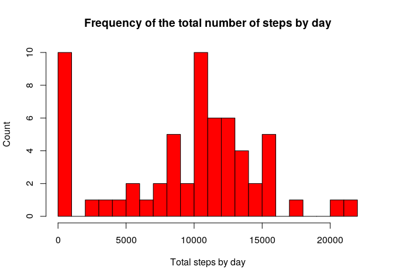
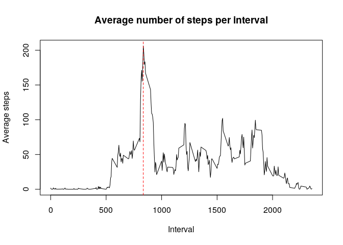
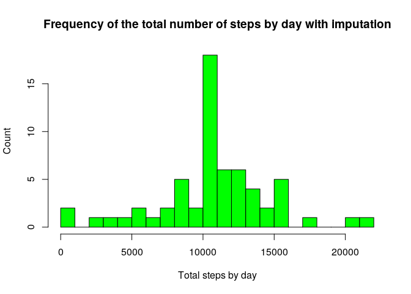
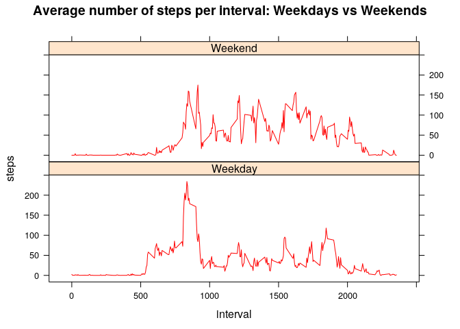

First off, we need to load the libraries, which we will need to use throughout this project. Also, we create the directory to store our plots, if it does not exist already.

```r
library(knitr)
library(lattice)

if (!dir.exists("figures/")) {dir.create("figures/")}
```
Set path

```r
knitr::opts_chunk$set(fig.path = "figures/")
```
## Loading and preprocessing the data
We unzip the downloaded archive and we create a dataframe from the csv file within.

```r
if (!file.exists("activity.csv")) {
  zipFile <- "activity.zip"
  unzip(zipfile = zipFile)
}

activityDf <- read.csv("activity.csv")
```

The elements in the "date" field  are not loaded in the correct format automatically, since their class is factor. A call to the function ```as.Date()``` fixes the issue quickly.

```r
activityDf$date <- as.Date(activityDf$date, format = "%Y-%m-%d")
```
## What is mean total number of steps taken per day?

We first compute the total number of steps measured each day, by means of the ```tapply()``` function. 


```r
totStepsByDay <- tapply(activityDf$steps, activityDf$date, sum, na.rm=TRUE)
```
We can plot the histogram of the result with the base package, since the figure is simple.


```r
hist(totStepsByDay, breaks = 20, col = "red",
      main = "Frequency of the total number of steps by day",
      xlab = "Total steps by day", ylab = "Count")
```

<!-- -->

The mean and the median of the total number of steps read:

* **Mean:** 9354
* **Median:** 10395

Please note that the mean has been rounded to the nearest integer, since this is the data type of the number of steps.

## What is the average daily activity pattern?

First off, we have to make a time series plot. We preprocess the data with the ```aggregate()``` function.


```r
stepsPerInterval <- aggregate(steps ~ interval, activityDf, mean, na.rm=TRUE)
names(stepsPerInterval) <- c("interval", "mean_steps")
```
Before making the plot, we need one last ingredient. We have to check how much is the maximum number of steps and what interval it corresponds to.

```r
m <- max(stepsPerInterval$mean_steps)

xaxis.abline <- stepsPerInterval[stepsPerInterval$mean_steps == m,]$interval
```


```r
plot(stepsPerInterval$interval, stepsPerInterval$mean_steps, type="l",
     main = "Average number of steps per interval", xlab = "Interval",
     ylab = "Average steps")
abline(v = xaxis.abline, lwd = 1, lty = 2, col = "red")
```



In particular, the maximum and the interval at which it occurs are obtained as follows:

```r
stepsPerInterval[stepsPerInterval$mean_steps == m,]
```

```
##     interval mean_steps
## 104      835   206,1698
```

## Imputing missing values

We can check the number of observations with missing values, we can simply count the number of records which are not complete. This is easily achieved thanks to the function ```sum()```, since we know that the only incomplete field is "steps".

```r
sum(is.na(activityDf$steps))
```

```
## [1] 2304
```
The fraction of missing values is around 13% of the total, we will take care of the imputation by means of the mean of steps during that interval.
Let's copy the dataframe and impute the missing values:

```r
completeDf <- activityDf

for (i in 1:nrow(completeDf)){
  if (is.na(completeDf[i,"steps"])){
    interval <- completeDf[i,"interval"]
    completeDf[i,"steps"] <- stepsPerInterval[stepsPerInterval$interval==interval,]$mean_steps
  }
}
```
Let us reproduce the histogram with imputed values

```r
imputedStepsByDay <- tapply(completeDf$steps, completeDf$date, sum)

hist(imputedStepsByDay, breaks = 20, col = "green",
      main = "Frequency of the total number of steps by day with imputation",
      xlab = "Total steps by day", ylab = "Count")
```

<!-- -->

The new mean and median are:

* **Mean:** 1,0766\times 10^{4}
* **Median:** 1,0766189\times 10^{4}

They are increased and they coincide now.

## Are there differences in activity patterns between weekdays and weekends?

First off, we have to create a factor variable with two levels: "Weekday" and "Weekend".

```r
Sys.setlocale("LC_TIME", "C")   #To have day names in english
```

```
## [1] "C"
```

```r
is_weekday <- factor(weekdays(activityDf$date) %in% c("Saturday", "Sunday"),
                     labels = c("Weekday", "Weekend"))
```
Now, we aggregate this new field, plus the intervals, to the number of steps calling the ```mean()``` function. In this way we get the average number of steps per interval and type of day. Finally, we create the desired plot.

```r
to_plot <- aggregate(activityDf$steps ~ activityDf$interval + is_weekday,
                     activityDf, mean)
names(to_plot) <- c("interval", "is_weekday", "steps")

xyplot(steps ~ interval | is_weekday, 
       to_plot, type = "l", col = "red", layout = c(1,2),
       main = "Average number of steps per interval: Weekdays vs Weekends")
```

<!-- -->
